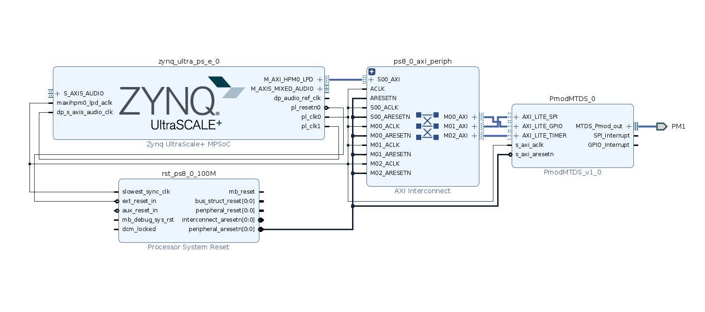

# Multi Touch Display Iterfacing with TE0802 Board

In this project we are going to demonstrate the possibility to control an LCD interfaced with R5 processor from Linux running on A53 Processor on a Xilinx Ultrascale+ device.

We are Using TE0802 Ultrascale+ Board by Trenz Electronics.
We will interface the LCD Touch screen with R5 Processor
We Will install Linux on A53 Processor
Using Memory Mapped Commumication, We Will create a communication channel between the two processors
And We will interact with the drivers of the LCD from the linux through the Memory mapped channel

## Requirements

### Software Requirements

- Xilinx Vivado
- Xilinx Petalinux Tools

### Hardware Requirements

- Trenz TE0802 FPGA Board (or a similar Ultrascale+ board)
- Digilent PMOD MTDS Touch Screen
- Micro SD Card (8GB or more)
- Micro SD Card Reader


## Architecture

As it is already described that Xilinx Ultrascale+ based FPGA is being used in developemnt of this project. The aim of this project is to integrate Digilent's MTDS Touch display with Trenz TE0802 developement board. However the integration of the LCD display would be a bit different than the usual integration.

Here we would like to run linux on the A53 processor and the LCD display would be handled by the R5 processor. This is done in order to avoid jitters in the display. As the linux systems gets overloaded with different processes which cause the screen to lag. Therefore, in order to avoid such issues, we want to use the realtime processor R5 to handle the task of managing the screen related tasks.

The main program aims to run on the linux system and the output of the program would be displayed on the LCD display. Therefore, there needs to be a mechanism, a communication channel, which allows us to communicate between the R5 processor and the linux on A53 processor. Fortunately there is a library known as OpenAMP built on top of libmetal library. This library can be used to develop a channel for interprocessor communication. The architecture of the system can be seen in the figure below.


## Block Diagram

The Block diagram of the vivado project can be seen in the figure below. Here you would see that I am using the PmodMTDS IP. In order to include this library I have included the all the ips from the digilent's repository. 

After Running the connection automation the block design should look similar to the one shown here, except PM1 port. This port is not present by default. Therefore, we have to include it manually by writing constraints in a constraints file. Our aim is to connect the PMOD MTDS Touch Screen with a pmod connector to one of the PMOD sockets on the TE0802 FPGA board. I have decided to use the J5 port, therefore, by looking at the user manual of TE0802 I was able to write the constraints of J5 port to `ioc.xdc` file




While creating your vivado project, **you must include** `ioc.xdc` file in the constraints files. Now everything should be fine and ready to build. So, now click on the generate bitstream button and wait for vivado to complete the process. After you are done with this, export the hardware (also include the bitstream) by clicking on File > Export > Export Hardware.

## Code Distribution

The code in this repository is distributed in the following manner

1. libdisp_linux: This folder contains the source files which abstract out the implementation of the OpenAMP library to perform the communication between LCD and Linux.

2. r5_baremetalL This contains the sourcefiles which would run on the r5 processor.

## Petalinux Installation

### Create Petalinux Project

First we have to create a petalinux project. I have already Written a tutorial for TE0802 Ultrascale+ device. If you are interested in it, you can see it in the following link: <https://github.com/e-phantom/linux-on-te0802>

If you already know how to install petalinux yourself, then you only need to create a petalinux project and change the root filesystem from INITRD to SD Card.

### Creating A PetaLinux Application

We would like to create an application that would run on R5 processor. However the creation process is a bit different than what we assume. We want to create a petalinux application and install it on the linux so that when the linux is powered up, we can easily deploy this applicaiton to the r5 processor.

In order to create a petalinux application, run the following command

```
petalinux-create -t apps --template install -n whatsup --enable
```

This creates a folder for your app in `<petalinux-project-directory>/project-spec/meta-user/recipes-apps`. Now go to the folder and replace the `whatsup.bb` file with the `whatsup.bb` file from this repository. 

Now go ahead and copy the `elf` file from the r5 C++ project to `whataup/files` folder.

### Update the Device Tree

Copy the Device Tree file, `system-user.dtsi` to `<petalinux-project-directory>/project-spec/meta-user/recipes-bsp/device-tree/files`


### Build Petalinux

Now Build the Petalinux Project using the following command

```
petalinux-build
```

### SD Card Image

After building the petalinux, now we should package the linux files into a BOOT.BIN file and then copy the appropriate files into the SD Card. If you are not familiar with partitoning and burning an SD card, you can take help from my other tutorial <https://github.com/e-phantom/linux-on-te0802>

## Creating A Shared Libarary Project

In order to create a shared library project in Vitis, got o File > New > Libaray project.
Followed by choosing a platoform from a repository (given that you have already included the XSA file, otherwise click on, create a new platform project from the hardware). Click Next and then choose Shared Library. Write down a name for the library (in our case we named it "disp") and then choose a target processor (`psu_cortexa53 SMP`). Click Next then Next and choose an empty C application. Finally click finish to create the project.

As soon as you have created the library project, copy the files from the folder libdisp_linux/disp/src, `lcd.h` and `lcd.c` to the `src` folder in the project. Now go ahead and build the project. When the build is completed, you will see a file named as `libdisp.so` in the Debug folder in the project. We will save this file for later as this file would be included in the python program.

Next we would like to copy the `libdisp.so` file to the petalinux using ssh. Therefore, connect the board with the a LAN using an ethernet cable and the following command on the host machine

```
scp <path-to-library-project>/Debug/libdisp.so root@<ip address of the board>/home/root
```

## Executing The Program

Deploying the application to r5 processor

```
echo r5_amp.elf > /sys/class/remoteproc/remoteproc0/firmware
echo start > /sys/class/remoteproc/remoteproc0/state
```

### Python Wrapper

How to use libdisp in python:

```
from ctypes import cdll
lib = cdll.LoadLibrary('./libdisp.so')

lib.start_app()
lib.setup()

lib.drawText("Hello World".encode(), 20, 20)

```

The output of the following script can be seen in the image below:

